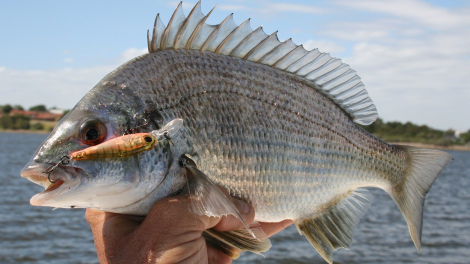
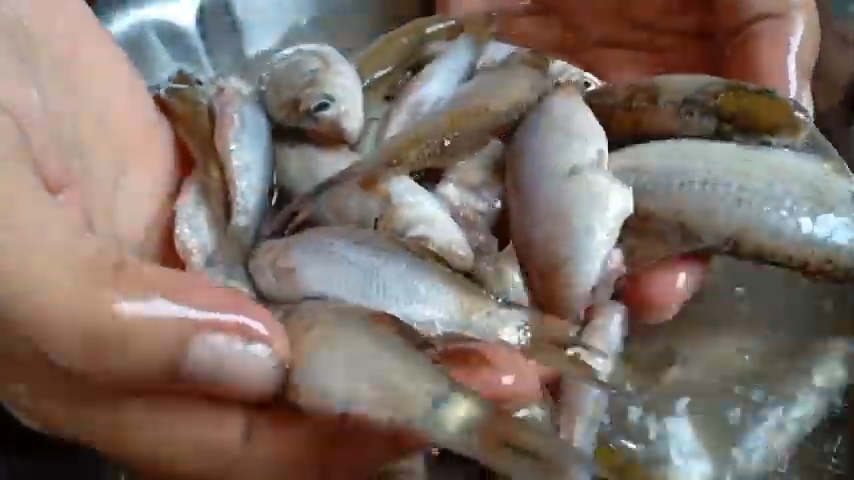
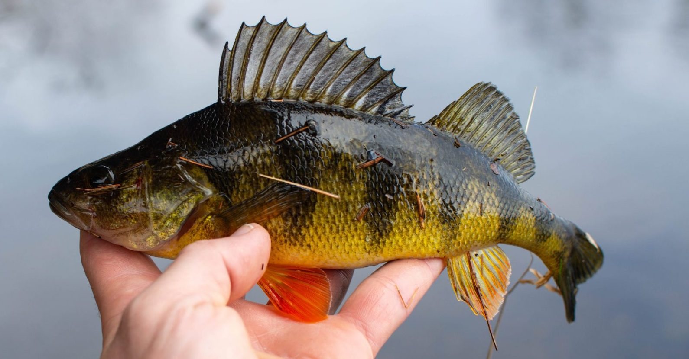
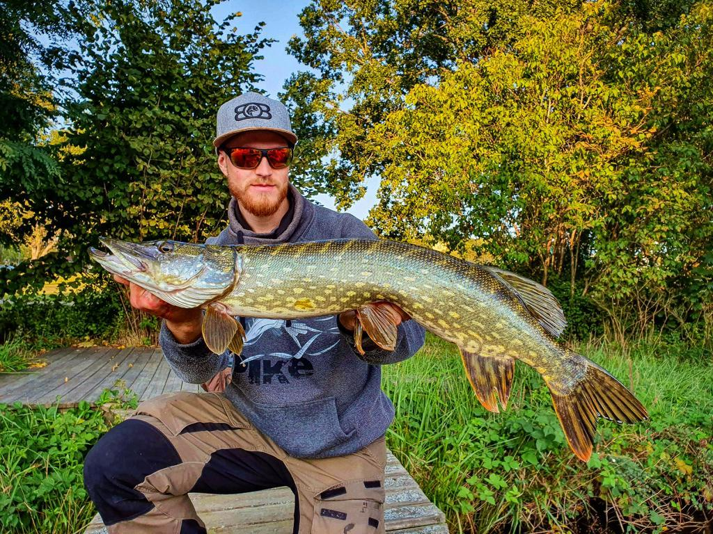
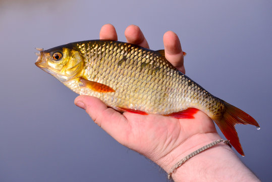
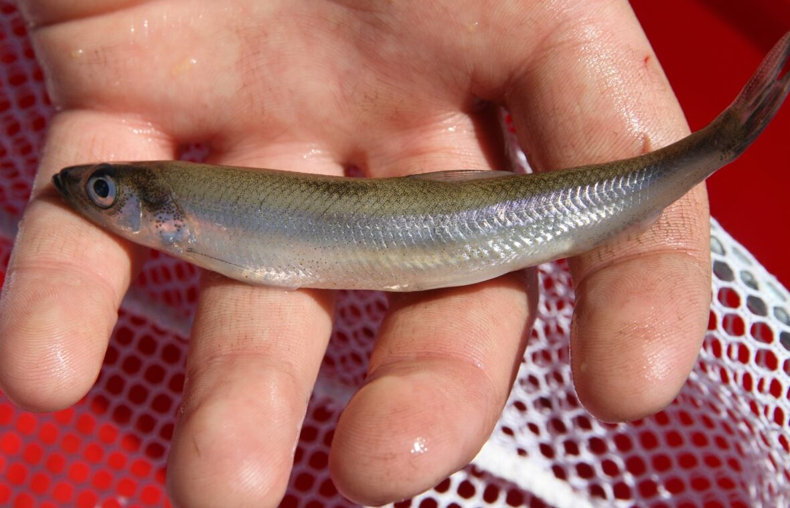
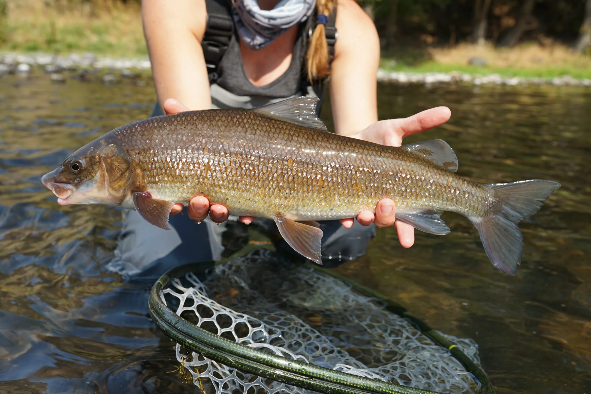

<style>
body {
text-align: justify}
</style>

```{r setup, include=TRUE}
# clear-up the environment
rm(list = ls())

# chunk options
knitr::opts_chunk$set(
  message = FALSE,
  warning = FALSE,
  fig.align = "center",
  comment = "#>"
)
```

<style>
body {
text-align: justify}
</style>


# Intro

This article is made for completing the assignment for **Algoritma : Machine Learning Course** in **Linear Regression Material** Theia Batch 2022.

We are going to use fish measurement data in one fish market to learn about linear regression techniques to predict weight of fish based on variables available in the dataset. In real life application, the weight of the fish is correlated with the price of the fish, so the target variable on this article would be weight.
 
In this dataset there are few assumptions :
* Data is taken in one Marketplace
* There are only 7 kind of fishes sold in the Marketplace
* Data is taken in one point of time where external effects on the fish weight is not taken into account

# Explaratory Data Analysis

## Load Library 

```{r}
options(scipen = 99) #non active science annotation (example : e-1)
library(tidyverse) #load several important libraries 
library(dplyr) #grammar of data manipulation
library(ggplot2) #plotting data visualization
library(scales) #edit scales
library(GGally) #plotting data visualization
```

## Load Dataset 

```{r}
#load dataset
fish <- read.csv("data-input/fish.csv")
glimpse(fish)
```
Based on the Dataset Information, Length 1 means vertical length in centimeters (cm), Length 2 means diagonal length in cm, Length 3 means cross length in cm. We will change the column name based on this information to make easier data wrangling.

```{r}
fish_clean <-
  fish %>%
  mutate(Species = as.factor(Species), 
         Vertical.Length = Length1, 
         Diagonal.Length = Length2, 
         Cross.Length = Length3) %>%
  select(-c(Length1, Length2, Length3))
glimpse(fish_clean)
```

- `Species` = Species of Fish sold in the Market
- `Weight` = Weight of Fish sold in gram
- `Height` = Height of Fish in centimeter
- `Width` = Width of Fish in centimeter
- `Vertical.Length` = Vertical Length of Fish in centimeter
- `Diagonal.Length` = Diagonal Length of Fish in centimeter
- `Cross.Length` = Cross Length of Fish in centimeter

## Insight from Dataset

When looking at fish, there are two things most of us look at before deciding to buy. First we take a look at the species, and then we take a look at the weight. After that, we look at the size and later decide if the size and the weight make sense and reasonable. Some fish could have meat density different from others because of many factors and it also has an effect on the nutrition contained in the meat. This is why Tuna will cost much higher compared to common Bass. 

```{r, out.width = "100%", echo = FALSE, fig.align = "center", fig.cap = "Bream", fig.size = 8}

```

```{r, out.width = "100%", echo = FALSE, fig.align = "center", fig.cap = "Parkki", fig.size = 8}

```

```{r, out.width = "100%", echo = FALSE, fig.align = "center", fig.cap = "Perch", fig.size = 8}

```

```{r, out.width = "100%", echo = FALSE, fig.align = "center", fig.cap = "Pike", fig.size = 8}

```

```{r, out.width = "100%", echo = FALSE, fig.align = "center", fig.cap = "Roach", fig.size = 8}

```

```{r, out.width = "100%", echo = FALSE, fig.align = "center", fig.cap = "Smelt", fig.size = 8}

```

```{r, out.width = "100%", echo = FALSE, fig.align = "center", fig.cap = "Whitefish", fig.size = 8}

```


After simple research for the fish species, I took several images that display the average size of each species. Assuming the hand size is the same, we can see that each fish has very different characteristics, size, and proportion on its body. This could affect data prediction so we may have to separate each species modeling, we will decide later. 

# Modelling Data

## Data Inspection and Validation

Before we continue, let's take more look at the the data.

```{r}
summary(fish_clean$Weight)
```
There is strange data here which the minimum weight is 0

```{r}
ggplot(data = fish_clean, (aes(y = Weight))) + 
  geom_boxplot(aes(fill = Weight), width = 1)
```
We see that there are *three data* which is classified as outliers based on Boxplot Interquartile Method

We also take a look at weight for each species

```{r}
ggplot(data = fish_clean, aes(x = Species, y = Weight)) + 
  geom_boxplot(aes(fill = Weight), width = 0.8, outlier.shape = NA) +
  geom_jitter()
```
Apparently the three outliers from before is the very huge Pike fish if we look at the boxplot of Pike

If we take a look at Smelt Fish, we can see that the fishes is consisted on very light (few grams) population. Which means the fish can't grow big (maximum size is small)

## Data Cleansing

Check Missing Value 

```{r}
colSums(is.na(fish_clean))
```


We wanted to see which row contains `Weight==0` 

```{r}
fish_clean %>% filter(Weight == 0)
```
Based on data above, it is impossible that kind of fish has 0 gram of weight. It must be failed input of the data.

```{r}
fish_clean <- subset(fish_clean, Weight != 0)
```

Since Smelt Fish is so small and consist of very small weight, it will not going to produce anything significant in our models. Therefore we can remove it from our dataset
And also, it is very uncommon when people buy very small fish individually and check the size from each of the fish. 

```{r}
fish_set <- fish_clean %>% filter(Species != "Smelt") %>% droplevels()
```

## Correlation Data

```{r}
ggcorr(fish_set, hjust = 1, layout.exp = 3, label = TRUE, label_size = 2.5)
```
Based on diagram above. Vertical.Lenth, Diagonal.Length and Cross.Length is correlated very high and it is sign of linearity. Therefore we exclude two of those column from the dataset.
It is possible because fish are usually in the shape of a long rectangular shape, therefore between the cross length and vertical length and diagonal length is very highly correlated.

```{r}
fish_set <- fish_set %>% select(-c(Cross.Length,Vertical.Length))
```

```{r}
ggcorr(fish_set, hjust = 1, layout.exp = 3, label = TRUE, label_size = 2.5)
```

## Linear Modelling

All kind Fish included with Every Variables
```{r}
model_fish_all <- lm(Weight~., data = fish_set)
summary(model_fish_all)
```
Based on model above, we can see that the Species Pike has significantly more higher P Value than other species.
The most significant variables above is `Intercept` and `Diagonal.Length`.

We will see initial performance of this model with Data Visualization

```{r}
ggplot(data = fish_set, mapping = aes(x = Weight, y = Diagonal.Length)) + 
  geom_point() +
  stat_summary(fun.data= model_fish_all) + 
  geom_smooth(method='lm') +
  scale_y_continuous(limits = c(5, 60))
```

Based on the plot above, we can see that our model is still underfit (don't bother to measure the performance, it is very bad based on the plot alone)

Model Visualization with Linear Regression for Each `Species`, but only measuring With `Diagonal.Length`

```{r}
ggplot(data = fish_set, mapping = aes(x = Weight, y = Diagonal.Length)) + 
  geom_point(aes(color=Species), size = 1) +
  geom_smooth(method=lm,se=FALSE,fullrange=TRUE,
                  aes(color=Species), size = 0.5) +
  scale_y_continuous(limits = c(5, 60))
  
  
```

We can get some insight about the data from plot above :

* There are two group of fish. One : Roach and Parkki. Two : Pike, Whitefish, Bream, and Perch.
* The Linear Model we created is forced to accomodate the data of Roach and Parkki which the slope is significantly different with other fishes.

Let see the distribution for each species

```{r}
ggpairs(data = fish_set, 
        columns = c(1,5),
        diag = list(discrete="barDiag",
                    continuous = wrap("densityDiag",
                                      alpha=0.5 )),
        mapping = aes(color=Species))
```
To make the models more accurate, we can treat these two group as different population.
Based on the data, it looks like Roach and Parkki belongs to small-fish group that is not sold individually.

Therefore, we make the dataset into two group.

```{r}
small_set <- fish_set %>% filter(Species %in% c("Roach","Parkki"))
big_set <- fish_set %>% filter(Species %in% c("Pike", "Whitefish", "Bream", "Perch"))
```

Based on the Correlation Value, it seems that every variables are highly correlated with each other.
We will make two models, with all predictor and with one predictor, we choose `Diagonal.Length` for model with one predictor.

```{r}
#all predictor
model_small_fish <- lm(Weight~., data = small_set)
model_big_fish<- lm(Weight~., data = big_set)

#one predictor
model_small_fish_1 <- lm(Weight~Diagonal.Length, data = small_set)
model_big_fish_1 <- lm(Weight~Diagonal.Length, data = big_set)
```

# Model Evaluation

## Create Prediction Value

```{r}
fish_set$Weight.Predict <- predict(object = model_fish_all, newdata = fish_set)

small_set$Weight.Predict <- predict(object = model_small_fish, newdata = small_set)
small_set$Weight.Predict.1 <- predict(object = model_small_fish_1, newdata = small_set)

big_set$Weight.Predict <- predict(object = model_big_fish, newdata = big_set)
big_set$Weight.Predict.1 <- predict(object = model_big_fish_1, newdata = big_set)
```
## R-squared

Goodnes of Fit based on R Squared Value

```{r, echo=FALSE}
library(MLmetrics)

#all species
RMSE(y_pred = fish_set$Weight.Predict, y_true = fish_set$Weight)
range(fish_set$Weight)

#small fish
RMSE(y_pred = small_set$Weight.Predict, y_true = small_set$Weight) #all predictor
RMSE(y_pred = small_set$Weight.Predict.1, y_true = small_set$Weight) #1 predictor
range(small_set$Weight)

#big fish
RMSE(y_pred = big_set$Weight.Predict, y_true = big_set$Weight) #all predictor
RMSE(y_pred = big_set$Weight.Predict.1, y_true = big_set$Weight) #1 predictor
range(big_set$Weight)
```

Based on the value above :
* The performance of the model will be better if it's using all predictors instead of one.
* Model for small fish can predict better, because the range of value for target variable `Weight` is also significantly smaller.
* Model for big fish performance is lower than Model for all fish, because it seems the growth of fish correlated with the weight is not in linear function (could be exponential)

## Variable Linearity

```{r}
cor.test(fish_set$Width, fish_set$Diagonal.Length)
```
```{r}
cor.test(fish_set$Width, fish_set$Height)
```
```{r}
cor.test(fish_set$Height, fish_set$Diagonal.Length)
```
Based on the value above, there's linearity because p-value < alpha
Therefore, only use one predictor is better for making this model.

## Normality of Residuals

We only take three of the best models for this analysis. 
Model 1 : All kind of Fish, and All Predictors
Model 2 : Small Fish, and All Predictors
Model 3 : Small Fish, One Predictor

```{r}
# histogram residual
hist(model_fish_all$residuals)
```
```{r}
# histogram residual
hist(model_small_fish$residuals)
```
```{r}
# histogram residual
hist(model_small_fish_1$residuals)
```

## Shapiro Test

```{r}
# shapiro test dari residual
shapiro.test(model_fish_all$residuals)
```

```{r}
# shapiro test dari residual
shapiro.test(model_small_fish$residuals)
```
```{r}
# shapiro test dari residual
shapiro.test(model_small_fish_1$residuals)
```

alpha = 0.05

Based on the value above, only `model_small_fish_1` that accept assumption Normality of Residuals with 95% Confidence Level.

The data is not distributed normally on the rest of the model.

## Homoscedasticity of Residuals

```{r}
# bptest dari model
library(lmtest)
bptest(model_small_fish_1)
```
alpha = 0.05

Based on the value above, we can take that the data is spread on pattern (homoscedasticity) with 95% Confidence Level.

## No Multicollinearity

For this test, we use `model_fish_all` because it's using all predictors.

```{r}
# vif dari model
library(car)
vif(model_fish_all)
```

* VIF > 10: multicollinearity
* VIF < 10: no multicollinearity

Based on values above, there are multicollinearity on the predictors used in the `model_fish_all`

# Conclusion

In Conclusion : 

-The best model we can make in this Article is 'model_small_fish_1', which is the model that predict small fish only with one Predictor.

-The Dataset is not distributed normally, which cause big error in some of model predictions. Therefore it would be better to log transform the data before doing modelling.

-The Number of Data is not sufficient to make better model, especially for the bigger fishes.

# Reference

1. [Kaggle Dataset : Fish Market Dataset](https://www.kaggle.com/datasets/aungpyaeap/fish-market)


